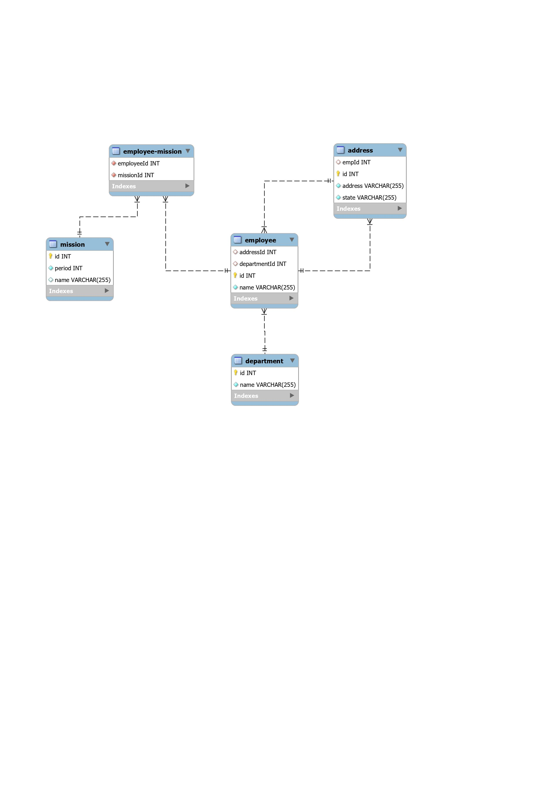
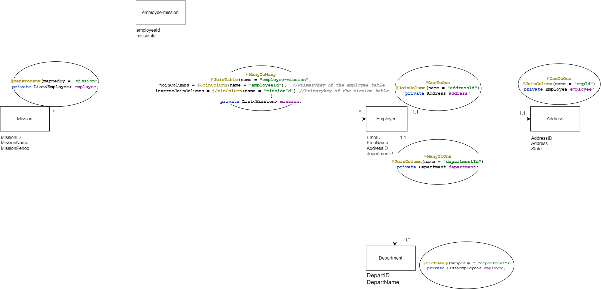

# EntityRelationShip-JPA
Source code to explore the relationships between entities in a database. This project demonstrates the use of MySQL and the implementation of Entity-Relationship (ER) modeling in Java, focusing on how classes are created and mapped to database tables.

**ER-v1-Diagram**
--

**ER-Flow-With Annotation Reference Diagram**
---

